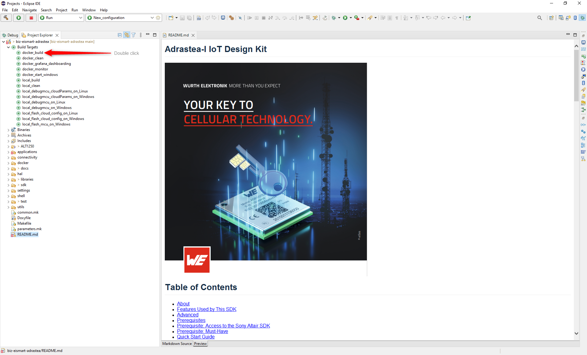

# Adrastea-I – Firmware Build Guide Using Docker Toolchain with Eclipse

This guide provides step-by-step instructions for setting up, building, and debugging the Adrastea-I firmware using the Eclipse IDE and a Docker-based toolchain.

---

## Table of Contents

1. [Prerequisites](#prerequisites)  
2. [Import Project into Eclipse](#import-project-into-eclipse)  
3. [Build the Project](#build-the-project)  
4. [Debugging](#debugging)

---

## Prerequisites

- **Eclipse IDE for Embedded C/C++ Developers**

- **Docker Engine**  
  Follow the installation instructions in this [Docker Engine Installation Guide](../../../../development-environment/docker-toolchain/docker_toolchain/docker-engine-installation.md).

- **Docker Toolchain for Adrastea-I**  
  Install the toolchain by following this [Adrastea Docker Toolchain Guide](../../../../../docs/development-environment/docker-toolchain/docker_toolchain/adrastea-docker-based-toolchain.md).

---

## Import Project into Eclipse

1. Open Eclipse and select a workspace.
2. Navigate to `File` > `Import`.
3. Select **Existing Projects into Workspace**.
4. Browse to the cloned repository folder and click `Finish`.

---

## Build the Project

- In the **Project Explorer**, select the `docker_build` target and double-click it.

---

## Debugging

Refer to the official [Sony Altair ALT125X MCU Debugging Guide on Eclipse](https://developer.sony.com/cellular-iot/developer-docs) for detailed instructions on debugging using Eclipse.

