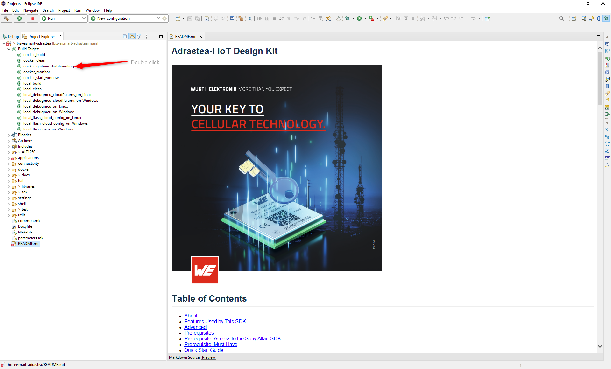
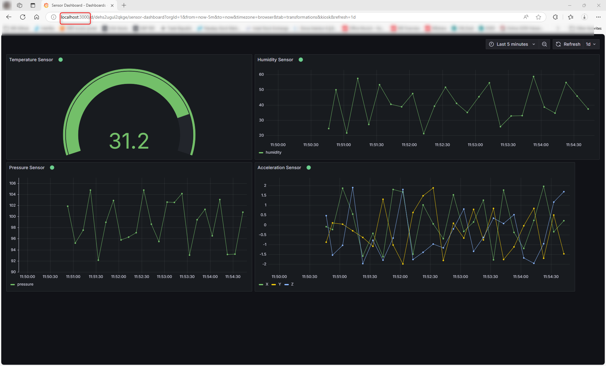

# Adrastea-I Grafana Dashboard through Eclipse

This guide provides step-by-step instructions for setting up the Adrastea-I Grafana dashboard using Docker and Eclipse.

---

## Table of Contents

- [Prerequisites](#prerequisites)
- [Importing the Project into Eclipse](#importing-the-project-into-eclipse)
- [Starting Grafana](#starting-grafana)
- [Visualizing Data in Grafana](#visualizing-data-in-grafana)

---

## Prerequisites

- **Eclipse IDE for Embedded C/C++ Developers**

- **Docker Engine**  
  Follow the installation instructions in the [Docker Engine Installation Guide](../../../../development-environment/docker-toolchain/docker_toolchain/docker-engine-installation.md).

- **Grafana Configuration**  
  Use the following guides to configure Grafana, Telegraf, and InfluxDB:
  - [Adrastea-I Guide for Docker-based Telemetry and Dashboard Tools](../../../../../docs/docker-telemetry-dashboarding/configuration-grafana-telegraf-influxdb.md)
  - [Visualizing IoT Data on Grafana](../../../../../docs/docker-telemetry-dashboarding/visualizing-data.md)

---

## Importing the Project into Eclipse

1. Open Eclipse and select your desired workspace.
2. Navigate to `File` > `Import`.
3. Choose `Existing Projects into Workspace`.
4. Browse to the cloned repository folder and click **Finish**.

---

## Starting Grafana

- In the **Project Explorer**, select the `docker_grafana_dashboarding` target.
- Double-click the target to launch the Grafana container.

---

## Visualizing Data in Grafana

1. Open your browser and navigate to **http://localhost:3000**.
2. Configure your device based on the target cloud platform.
3. Set up your Grafana data source and dashboard accordingly.
4. View your sensor values using the configured MQTT data source.

