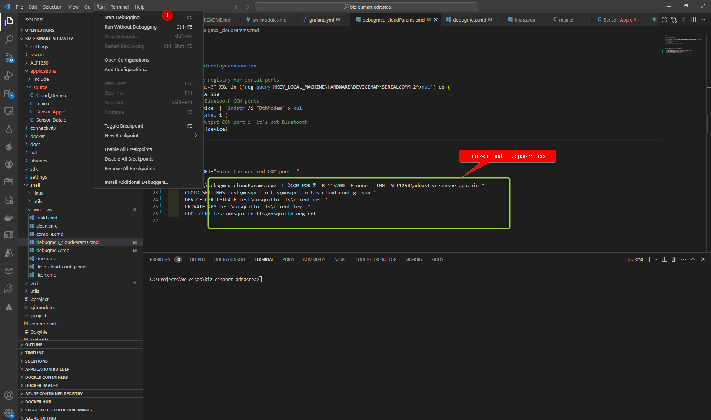

# Adrastea-I Debugging MCU Using Visual Studio Code

- [Adrastea-I Debugging MCU Using Visual Studio Code](#adrastea-i-debugging-mcu-using-visual-studio-code)
  - [Environment Settings](#environment-settings)
  - [Task Categories](#task-categories)
    - [Local Development Tasks](#local-development-tasks)
  - [How to Use](#how-to-use)
    - [Connect Your Debugger to the Adrastea-I EV Board](#connect-your-debugger-to-the-adrastea-i-ev-board)
    - [Set your Cloud Parameters](#set-your-cloud-parameters)
    - [Start Debugging](#start-debugging)
    - [Serial COM Port Selection](#serial-com-port-selection)
    - [Memory View and Debug Launch](#memory-view-and-debug-launch)
  - [Task Descriptions](#task-descriptions)


## Environment Settings

To set up your development environment, install the Cortex Debug plugin from the following [link](https://github.com/Marus/cortex-debug?tab=readme-ov-file).

Then, add your toolchain paths to your `settings.json` file:

```json
{

    "toolchains.mcu_build_tools": "<Path_to_your_mcu_build_tools>",
    "toolchains.arm_toolchain": "<Path_of_arm_toolchain>",
    "terminal.integrated.env.windows": {
        "cortex-debug.JLinkGDBServerPath": "<Path_to_your>\\JLinkGDBServer.exe",
        "cortex-debug.armToolchainPath": "<Path_to_your>\\gcc-arm-none-eabi-10.3-2021.07\\bin",
        "cortex-debug.armGdbPath": "<Path_to_your>\\gcc-arm-none-eabi-10.3-2021.07\\bin",
        "cortex-debug.openocdPath": "<Path_to_your>\\gnu-mcu-eclipse-openocd-0.10.0-8-20180512-1921-win64\\GNU MCU Eclipse\\OpenOCD\\0.10.0-8-20180512-1921\\bin",
        "cortex-debug.showDevDebugOutput": "true"
    },
    
    "terminal.integrated.env.linux": {
        "cortex-debug.JLinkGDBServerPath": "<Path_to_your>/JLinkGDBServer",
        "cortex-debug.armToolchainPath": "<Path_to_your>/gcc-arm-none-eabi",
        "cortex-debug.openocdPath": "<Path_to_your>/openocd",
        "cortex-debug.showDevDebugOutput": "true"
    },
    
    "editor.folding": true,
    "editor.foldingStrategy": "auto",
    "editor.foldImports": true,
    "python.defaultInterpreterPath": "<python2.7_path>"
    
}


```

## Task Categories

### Local Development Tasks
These tasks facilitate compiling, cleaning, and debugging applications using local shell scripts:

- **Local-Debug_mcu** - Debugs the MCU locally.
- **Local-Debug_mcu_cloud_params** - Debugs the MCU with cloud parameters.

## How to Use

### Connect Your Debugger to the Adrastea-I EV Board

Follow these steps to set up the hardware connections:

1. Connect the **first pin** of your debugger to the **corresponding header** on the EV board  (1)
2. Plug in the **USB Micro cable** to power the module  (2)
3. Insert a **Nano SIM card** into the SIM slot on the EV board (3)


### Set your Cloud Parameters

- Open the script located at:  
  **`shell/Windows/debugmcu_cloudParams.cmd`**

- Edit the script and set the required cloud-related parameters:

  - **Cloud configuration file** (e.g., `cloud_config.json`)
  - **Device certificate** (`.crt` file)
  - **Private key** (`.key` file)
  - **Root certificate** (`.crt` file)
  - **Firmware image** (`.bin` file)

These parameters are essential for initializing cloud-related functionality, such as secure communication, during the debugging session.


### Start Debugging

Go to **Run > Start Debugging** in Visual Studio Code.



- Select **Debug_With_cloud_Settings** from the debug configuration options.


### Serial COM Port Selection

- Select the appropriate **Serial COM port** for debugging  
- **Reset** your module  
- Press **Enter** to continue


### Memory View and Debug Launch

You can set breakpoints (1) and view logs from the terminal (2):

1. **Set breakpoints** in your source code to pause execution at desired lines  
2. **Monitor terminal logs** to observe program behavior during debugging


## Task Descriptions
For more details, refer to the `tasks.json` file in the project.

