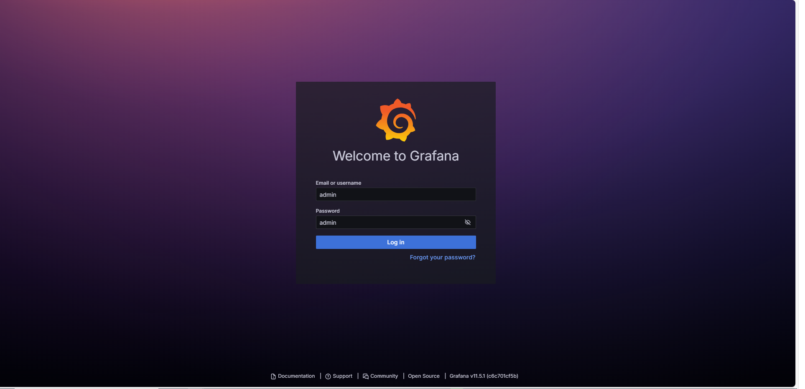

# Adrastea-I Visualizing IoT Data on Grafana

## Table of Contents

- [Start Docker-Based Grafana Container through VS-Code](#start-docker-based-grafana-container-through-vs-code)
- [Browse Grafana Web Interface and Set Your Credentials](#browse-grafana-web-interface-and-set-your-credentials)
- [Data Source and Design Your Own Dashboard Panel Settings](#data-source-and-design-your-own-dashboard-panel-settings)
- [Conclusion](#conclusion)

---

## Start Docker-Based Grafana Container through VS-Code

To get started, launch the Docker-based Grafana container directly from Visual Studio Code. This approach integrates container management into your development environment, simplifying setup and troubleshooting.

###  **Launch the Container:**
   - Open VS-Code.
   - Use the integrated task to run the Grafana container.
   - The following image demonstrates how the task should be executed:
     
     

 ### **Verify Service Status:**
   - Ensure that all required services are up and running. Confirm that the container and any associated services like influxdb , telegraf and mqtt broker are active.
   - The image below shows an example of correctly running services:
     
     

---

## Browse Grafana Web Interface and Set Your Credentials

Once the container is up, access the Grafana web interface to begin configuring your dashboard.

 ### **Access the Web Interface:**
   - Open your web browser and navigate to [http://localhost:3000](http://localhost:3000).
   - You will see the login screen prompting you to enter your default credentials.

 ### **Initial Login:**
   - The default username and password are both set to `admin`.
   - Refer to the image for visual confirmation of the login process:
     
     

 ### **Change Your Password:**
   - After logging in, you will be prompted to update your credentials for security purposes.
   - Follow the on-screen instructions to set a new password.
   - The following image provides a sample of the new password setup screen:
     
     

## Data Source and Design Your Own Dashboard Panel Settings

With your credentials set, proceed to configure your data source and design custom dashboard panels to visualize IoT data.

 ###  **Define Your Data Source:**
   - Navigate to the data source settings in the Grafana interface.
   - Configure your MQTT broker or other IoT data source as needed.
   - The images below illustrate the process of defining a data source and selecting MQTT:
     
     
     

### **Design Your Dashboard:**
   - Create a new dashboard by clicking on the **Dashboard** option and then **+ New Dashboard**.
   - Add a new panel by selecting **Add Visualization**.
   - Choose the data source you configured earlier for your panel settings.
   - The following images help guide you through creating a new dashboard and selecting your data source:
     
     
     
     

 ### **Customize Panel Settings:**
   - Enter your desired MQTT topics or other parameters in the panel settings.
   - Customize the visualization style, time range, and other settings to best represent your IoT data.
   - The image below shows how to enter your desired topics and adjust panel settings:
     
     

 ### **Save Your Dashboard:**
   - Once satisfied with your configuration, save the dashboard.
   - Your custom dashboard is now ready to display real-time data from your IoT devices or any other MQTT Client.

---

##  Conclusion

You have successfully set up and configured Grafana to visualize your IoT data. The final dashboard should provide an interactive interface where you can monitor and analyze your IoT metrics. Refer to the sample panel dashboard to demonstrate Adrastea Sensor Featherwing below for a preview of what your setup might look like:

