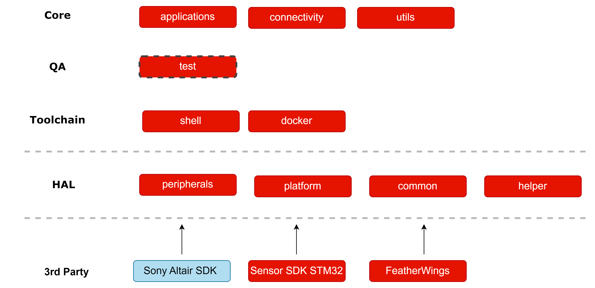

# Software Modules Overview

- [Software Modules Overview](#software-modules-overview)
  - [Overview](#overview)
  - [Software Modules](#software-modules)
  - [Software Bill of Materials (SBOM) for the Docker Image](#software-bill-of-materials-sbom-for-the-docker-image)
  - [Directory Structure](#directory-structure)

## Overview
This document provides an overview of the software modules and directory structure used in the project. The diagram below illustrates the module relationships.

## Software Modules

| Component      | Description  | Linked Components  |
|---------------|-------------|--------------------|
| **Core**      | Central component that coordinates the system's main functionalities | Applications, Connectivity, Utils |
| **Applications** | Specific applications built on top of the core functionalities | Core |
| **Test**      | Testing framework or system | QA |
| **Analysis**  | Analysis tools or modules | QA |
| **Connectivity** | Modules responsible for network or hardware connections | Core |
| **Shell**     | Shell interface or command-line interaction | Toolchain |
| **Docker**    | Containerization or environment setup tool | Toolchain |
| **Peripherals** | Hardware peripherals interacting with the system (I2C, UART) | HAL |
| **Platform**  | Platform abstraction layer | HAL |
| **Common**    | Shared functionality or libraries | HAL |
| **Helper**    | Helper modules that assist in the operation of core features | HAL |
| **3rd Party** | Third-party tools or SDKs | FeatherWings, Sony Altair SDK, Sensor SDK STM32 |
| **HAL**       | Hardware Abstraction Layer | - |
| **QA**        | Quality Assurance tools | Test |
| **Toolchain** | Development toolchain including compilers and build tools | Shell, Docker |
| **FeatherWings** | FeatherWings libraries for hardware integration | 3rd Party |
| **Sony Altair SDK** | SDK for integrating Sony Altair systems | 3rd Party |
| **Sensor SDK STM32** | SDK for integrating sensors on STM32 platforms | 3rd Party |

##  Software Bill of Materials (SBOM) for the Docker Image

| Package             | Version                             | Architecture | Origin        |
|---------------------|-------------------------------------|--------------|---------------|
| adduser             | 3.137ubuntu1                        | all          | Ubuntu Noble  |
| apt                 | 2.7.14build2                        | amd64        | Ubuntu Noble  |
| base-files          | 13ubuntu10.2                        | amd64        | Ubuntu Noble  |
| base-passwd         | 3.6.3build1                         | amd64        | Ubuntu Noble  |
| bash                | 5.2.21-2ubuntu4                     | amd64        | Ubuntu Noble  |
| bzip2               | 1.0.8-5.1build0.1                   | amd64        | Ubuntu Noble  |
| ckermit             | 408~beta11.20240207-1build2         | amd64        | Ubuntu Noble  |
| cmake               | 3.28.3-1build7                      | amd64        | Ubuntu Noble  |
| coreutils           | 9.4-3ubuntu6                        | amd64        | Ubuntu Noble  |
| cppcheck            | 2.13.0-2ubuntu3                     | amd64        | Ubuntu Noble  |
| doxygen             | 1.9.8+ds-2build5                    | amd64        | Ubuntu Noble  |
| gcc                 | 4:13.2.0-7ubuntu1                   | amd64        | Ubuntu Noble  |
| gcovr               | 7.0-1                               | all          | Ubuntu Noble  |
| gdb                 | 15.0.50.20240403-0ubuntu1           | amd64        | Ubuntu Noble  |
| graphviz            | 2.42.2-9ubuntu0.1                   | amd64        | Ubuntu Noble  |
| htop                | 3.3.0-4build1                       | amd64        | Ubuntu Noble  |
| libc-dev            | 1                                   | amd64        | Ubuntu Noble  |
| ninja-build         | 1.11.1-2                            | amd64        | Ubuntu Noble  |
| python-is-python3   | 3.11.4-1                            | all          | Ubuntu Noble  |
| socat               | 1.8.0.0-4build3                     | amd64        | Ubuntu Noble  |
| tar                 | 1.35+dfsg-3build1                   | amd64        | Ubuntu Noble  |
| valgrind            | 1:3.22.0-0ubuntu3                   | amd64        | Ubuntu Noble  |
| zip                 | 3.0-13ubuntu0.2                     | amd64        | Ubuntu Noble  |
| zlib1g-dev          | 1:1.3.dfsg-3.1ubuntu2.1             | amd64        | Ubuntu Noble  |
| gcc-arm-none-eabi   | 7-2018-q2-update-linux              | amd64        | Ubuntu Noble  |

## Directory Structure

| File/Folder  | Content  |
|-------------|----------|
| .vscode | Tasks and settings for VSCode |
| applications | User applications |
| connectivity | Cloud-based implementations |
| docker | Docker toolchain settings |
| docs | Documentation, including guides |
| hal | Hardware Abstraction Layer |
| libraries | Third-party libraries |
| sdk | Sony Altair and Würth Sensor SDK |
| settings | Custom linker settings |
| shell | CLI building utilities |
| test | Unit tests based on Ceedling |
| analysis | CPPCheck - static analysis tool results |
| utils | Common libraries |
| README.md | This file |

